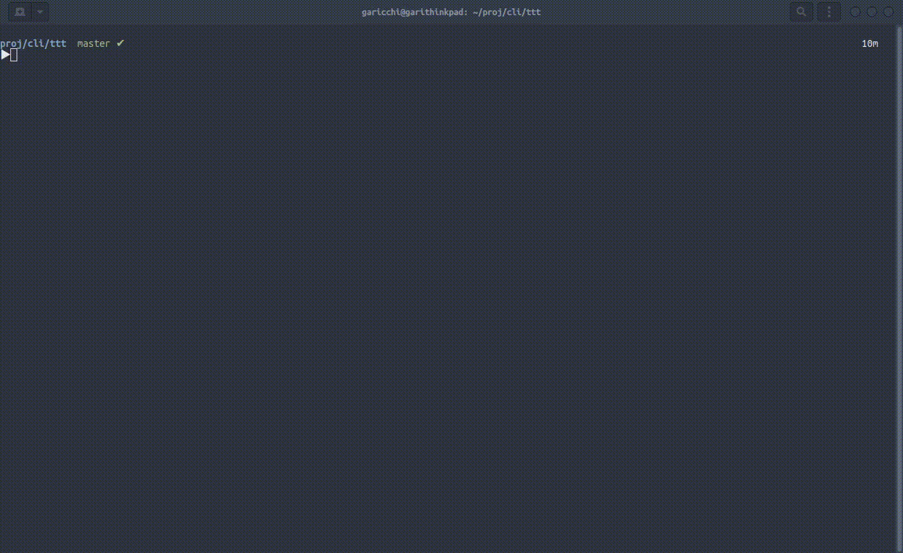
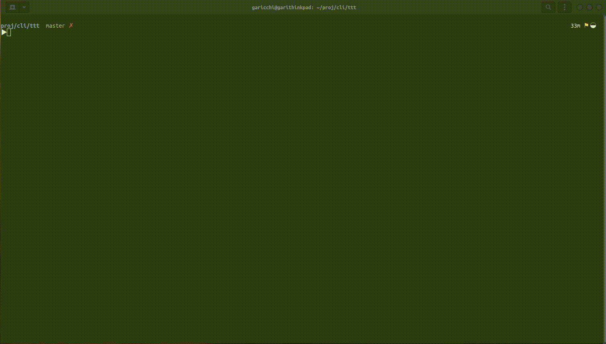
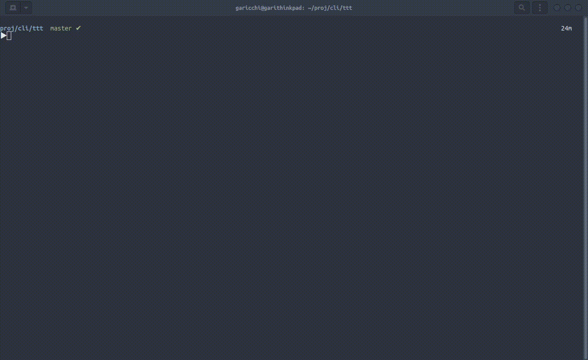
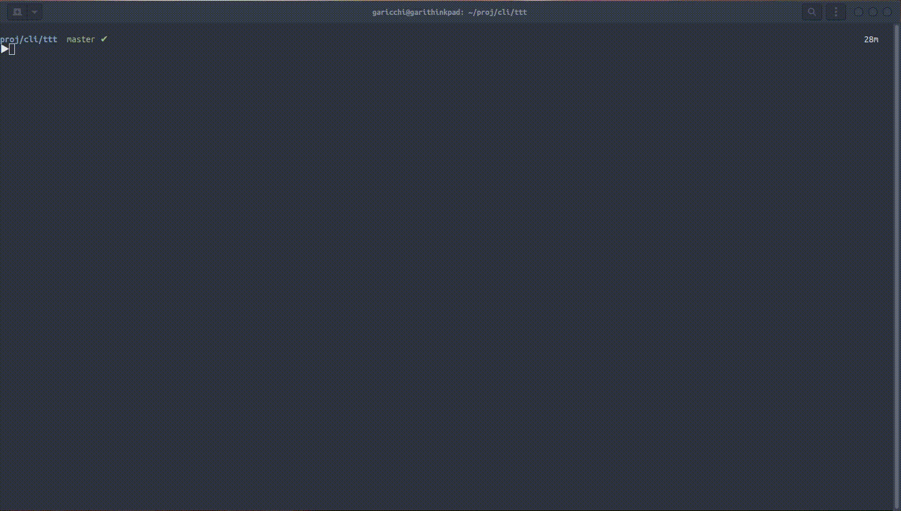

# ttt
ttt: togai tsv tool

```
$ ttt -h
usage: ttt [-h] {view,add-column,remove-column,edit,resolve} ...

togai tsv tool

positional arguments:
  {view,add-column,remove-column,edit,resolve}
                        sub-commands
    view                show tsv file
    add-column          add column to tsv file
    remove-column       remove column from tsv file
    edit                edit value in tsv file
    resolve             convert conflict marker to human readable

optional arguments:
  -h, --help            show this help message and exit

```

## INSTALL

required python 3.6 or later
```
# if you use windows
export PYTHONUTF8=1

pip install git+https://github.com/garicchi/ttt.git
```

## VIEW

tsvテーブルを整形表示


```
$ ttt view sample/sample.tsv 
```

ヘッダーを表示

```
$ ttt view --header sample/sample.tsv 
col1  
col2  
col3  
```

カラムを絞り込み

```
$ ttt view -c col2 -c col3 sample/sample.tsv 
```

インタラクティブにカラムを絞り込む

```
$ ttt view -i sample/sample.tsv
```

カラムのソート


昇順ソート
```
$ ttt view -s col2 sample/sample.tsv 
col1  	col2  	col3  
val1-1	val2-1	val3-1
val2-1	val2-2	val2-3
val3-1	val3-2	val3-3
```

降順ソート
```
$ ttt view -s col2 -r sample/sample.tsv 
col1  	col2  	col3  
val3-1	val3-2	val3-3
val2-1	val2-2	val2-3
val1-1	val2-1	val3-1
```

テーブルのjoin (left join)

ののキーを比較し、left joinを行います


`-on` でキーカラムを指定できます。指定しない場合一番左のカラムがキーカラムになります
```
$ ttt view -on col1=other1 sample/sample.tsv sample/sample02.tsv 
col1  	col2  	col3  	other1	other2   
val1-1	val2-1	val3-1	val1-1	other-2-1
val2-1	val2-2	val2-3	val2-1	other-2-2
val3-1	val3-2	val3-3	val3-1	other-2-3
```

結果の出力


結果のtsv書き出し
```
$ ttt view sample/sample.tsv -o sample/sample03.tsv
save completed in sample/sample03.tsv
```

結果をlessコマンドで表示する
```
$ ttt view -l sample/sample.tsv
```

## EDIT
tsvの値を変更します



```
$ ttt view sample/sample.tsv
col1	col2	col3
val1-1	val2-1	val3-1
val2-1	val2-2	val2-3
val3-1	val3-2	val3-3

# -kc 変更する行を特定するキーカラム
# -kd 変更する行を特定するキーのデータ(正規表現指定)
# -ec kcとkdによって特定した行のどのカラムを編集するか
# -ed 変更後の値
$ ttt edit -kc col1 -kd 'val(1|2)' -ec col2 -ed null sample/sample.tsv
col1       col2    col3  
val1-1  null    val3-1
val2-1  null    val2-3
val3-1  val3-2  val3-3
```

## RESOLVE
コンフリクトしたtsvをわかりやすいマーカーに変えます

カラムの変更や、同一キーはセル判定するなどに対応できます

同じキーの値がコンフリクトしている場合


カラムに変更が合った場合


```
<<<<<<< HEAD
col1	col2	col3
val1-1	val2-1	val3-1
val2-1	val2-2	val2-3
add-row01	add-row01	add-row01
val3-1	val3-2	val3-3
=======
col1	col2	col3	add01
val1-1	val2-1	val3-1	01
val2-1	val2-2	val2-3	01
val3-1	val3-2	val3-3	01
>>>>>>> test/01
```

```
$ ttt resolve sample/sample.tsv 
col1           	col2     	col3     	add01             
val1-1         	val2-1   	val3-1   	<< 01 >> [test/01]
val2-1         	val2-2   	val2-3   	<< 01 >> [test/01]
<<<<<<< test/01
=======        
add-row01      	add-row01	add-row01
>>>>>>> HEAD   
val3-1         	val3-2   	val3-3   	<< 01 >> [test/01]

```
